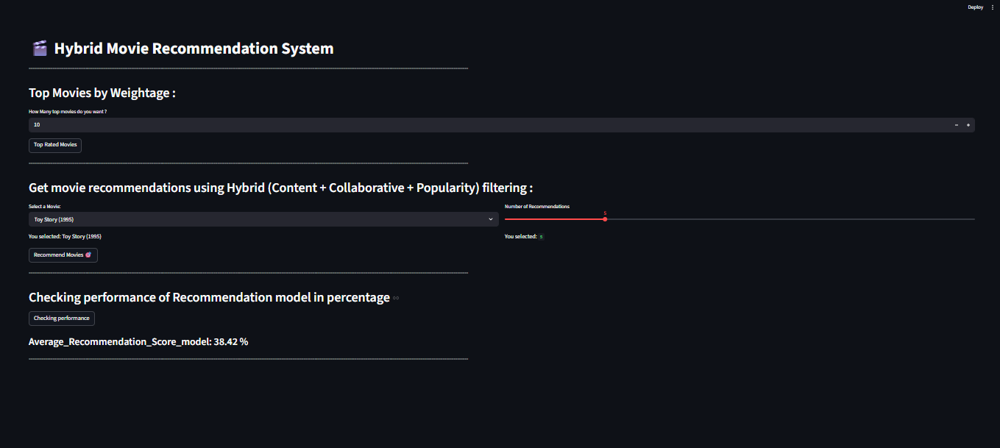

# End-to-End Hybrid Movie Recommendation System using Machine Learning, FastAPI, Streamlit and Docker

---

##  Project Description

This project builds a complete end-to-end Hybrid Movie Recommendation System using Machine Learning techniques. The system recommends movies to users based on their preferences by combining Collaborative Filtering and Content-Based Filtering approaches.

The project is developed using FastAPI for backend APIs, Streamlit for interactive UI dashboard, and Docker for containerization, making the application scalable and production-ready.

---

##  Problem Statement

With the increasing amount of digital content, users often struggle to find relevant movies. Recommendation systems help users discover movies tailored to their preferences.

This project aims to build a Hybrid Recommendation System that:

* Recommends personalized movies
* Suggests similar movies
* Handles cold start problem
* Improves recommendation accuracy

---

##  Exploratory Data Analysis (EDA)

Exploratory Data Analysis was performed to understand movie ratings and user behavior.

**Key analysis performed**:

* Rating distribution analysis
* User activity analysis
* Movie popularity analysis
* Genre distribution analysis
* Most rated movies
* Highest rated movies
* Data cleaning and preprocessing

---

##  Feature Engineering

To improve model performance, several transformations were applied:

* Merged ratings,users and movies datasets
* Removed duplicates and handled missing values
* Created movie popularity features(Weight)
* Created user-movie interaction matrix
* Processed genre features for content-based filtering

---

##  Machine Learning Models

Multiple recommendation techniques were implemented:

Content-Based Filtering
* TF-IDF Vectorization
* Cosine Similarity
* Genre-based recommendation
Collaborative Filtering
* Matrix Factorization using SVD
* User-based recommendation
* Personalized predictions
Hybrid Recommendation
* Combined collaborative and content-based approaches
* Weighted scoring system
* Cold start handling
* Popularity filtering

---

##  Model Evaluation

The recommendation system was evaluated using:

* Recommendation relevance


---

##  Final Model

Hybrid Recommendation System was selected as the final model because:

* Combines strengths of both models
* Provides personalized recommendations
* Handles cold start problem
* Improves recommendation accuracy

---

##  Model Explainability

The system explains recommendations using:

* Similar movie genres
* User rating patterns
* Popularity filtering

**Top influencing features:**
-

---

##  ML Pipeline

A complete ML pipeline was built to:

* Load data
* Perform preprocessing
* Train models
* Generate recommendations
* Serve predictions via API

---

##  Architecture

User → Streamlit Dashboard → FastAPI API → Hybrid ML Model → Recommendation Output

---

##  Tech Stack

**Programming:**
* Python

**Data Processing & Analysis:**
* Pandas
* NumPy

**Machine Learning:**
* Scikit-learn
* K-NearestNeighbour

**API Development:**
* FastAPI
* Pydantic
* Frontend Dashboard
* Streamlit

**Data Visualization:**
* Matplotlib
* Seaborn

**Containerization & Deployment:**
* Docker
* Docker Compose

**Development Tools:**
* Jupyter Notebook
* Git
* GitHub

---

##  Project Structure

```
project-3-hybrid_movie_recommendation_system
│   
│
├───api
│       main.py
│       requirement_api.txt
│
│
├───apps
│       requirement_apps.txt
│       streamlit_app.py
│       streamlit_app2.py
│
├───datasets
│       movies.dat
│       ratings.dat
│       README
│       users.dat
│   
│   
├───docker
│       .dockerignore
│       docker-compose.yml
│       Dockerfile.fastapi
│       Dockerfile.streamlit
│
├───docker-OneClickRun
│       docker-compose.yml
│       start.bat
│       stop.bat
│
├───models
│       collab_model.pkl
│       cosine_sim.pkl
│       df.pkl
│       movie_df.pkl
│       pivot_table_rating.pkl
│       title.pkl
│
├───notebook
│       final_model.py
│       final_model_selected.ipynb
│       hybrid_movie_recom.ipynb ( main file )
│     
│
├───src
|       pydantic_model.py
│
│ 
|   .gitattributes
│   .gitignore
│   requirements_exactly.txt
│   Screenshot_desktop.png    
│   README
 
```
---

##  Screenshots

#### Dashboard Preview:




---

## 🐳 Docker Setup & Installation

### Option 1: Full Setup

1. Install Docker Desktop

2. Clone the repository

```
   git clone https://github.com/chetansgode/Hybrid_Movie_Recommendation_System.git
```

3. Navigate to project folder

```
cd project-3-hybrid_movie_recommendation_system/docker
```


4. Run:

```
   docker compose up --build
```

5. Access:

* Streamlit → http://localhost:8501
* FastAPI Docs → http://localhost:8000/docs

6. Stop:

```
   docker compose down
```
---

### Option 2: Quick Start

1. Install Docker Desktop and start it

2. Download only this folder from github:

 **docker-OneClickRun**

```
project-3-hybrid_movie_recommendation_system
│  
├───docker-OneClickRun
│       docker-compose.yml
│       start.bat
│       stop.bat
```
- Note : docker_run_directly_by_image that already saved in dockerhub no need to download large file only download above folder file in your system.


3. Open the folder and double click:

start.bat

4. Access:
- Streamlit → http://localhost:8501
- FastAPI → http://localhost:8000/docs

5. To stop:
double click stop.bat


---

##  Results

* Successfully built hybrid recommendation system
* Personalized movie recommendations
* Cold start problem handled
* Improved recommendation quality

---

##  Limitations

* Depends on dataset quality
* Not deployed on cloud infrastructure

---

##  Future Work

*   Future Work
*   Add Deep Learning recommendation models
*   Deploy on AWS / Azure
*   Add real-time recommendations
*   Add user login system
*   Add movie poster integration

---

##  Conclusion

Hybrid Recommendation System provides more accurate and personalized movie recommendations by combining collaborative filtering,content-based filtering and popularity-base filtering approaches. The system is production-ready with FastAPI, Streamlit, and Docker integration.

---

##  Author

Name :
Chetan S. Gode
